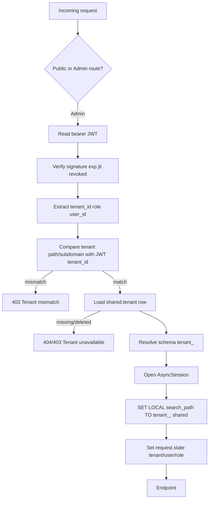

# RestoBot Phase 1 Private Beta Blueprint

Date: 2026-04-28
Scope: Weeks 1-8, Private Beta for 1-3 pilot restaurants
Repository baseline reviewed: `README.md`, `api/main.py`, `api/routes/*.py`, `shared/*.py`, `payments/worker.py`, `migrations/versions/*.py`, `.github/workflows/ci.yml`, `tests/*`

## Current State Summary

The repository is not a pure prototype anymore. It already contains:

- One FastAPI app for bot-facing and admin-facing APIs in [api/main.py](C:\Users\Имярек\Documents\Codex\2026-04-28\act-as-a-principal-software-architect\api\main.py)
- Telegram bot entrypoint in [bot/main.py](C:\Users\Имярек\Documents\Codex\2026-04-28\act-as-a-principal-software-architect\bot\main.py)
- Shared-tenant models for `tenants`, `plans`, `subscriptions` in [shared/models.py](C:\Users\Имярек\Documents\Codex\2026-04-28\act-as-a-principal-software-architect\shared\models.py)
- Raw SQL per-tenant data access across menu, orders, dashboard, payments
- YandexGPT RAG engine with cache and circuit breaker in [ai/rag_engine.py](C:\Users\Имярек\Documents\Codex\2026-04-28\act-as-a-principal-software-architect\ai\rag_engine.py)
- CI workflow already present in [.github/workflows/ci.yml](C:\Users\Имярек\Documents\Codex\2026-04-28\act-as-a-principal-software-architect\.github\workflows\ci.yml)
- Tests for many modules, including a skipped tenant isolation suite in [tests/test_tenant_isolation.py](C:\Users\Имярек\Documents\Codex\2026-04-28\act-as-a-principal-software-architect\tests\test_tenant_isolation.py)

Main gaps for marketable SaaS:

- No admin authentication flow or employee user model
- No onboarding wizard
- No admin-grade CRUD for menu/settings/orders
- No web widget channel
- No audit log implementation despite compliance intent
- No enforced JWT-to-tenant binding at middleware level
- No real-time WebSocket layer
- Existing dashboard analytics are useful but too narrow

## 1. Architecture Evolution Document

### 1.1 Recommended application topology

Keep one backend repository, but split runtime entrypoints into three deployable apps:

1. `public-api` FastAPI app
   - Telegram/web widget/public guest endpoints
   - Order creation, menu browsing, payment init, loyalty apply
   - Looser rate limits, guest sessions, anti-abuse controls

2. `admin-api` FastAPI app
   - Admin panel endpoints only
   - Stronger auth, RBAC, audit logging, onboarding, analytics, WebSocket auth
   - Separate CORS, CSP, cookie, and rate-limit policy

3. `worker` processes
   - Payments, analytics aggregation refresh, media processing, notification fanout

Why not keep a single FastAPI process for everything:

- Security boundary: admin endpoints need stricter cookies, CSRF, CSP, RBAC, and audit enforcement than guest APIs
- Scaling boundary: widget traffic and bot traffic are bursty; dashboard traffic is steady but WebSocket-heavy
- Operability: separate autoscaling and separate WAF/rate-limit rules are easier

Why not split into separate repositories:

- Too early for that. The codebase is still small and the domain logic should stay shared.
- Use a modular monorepo with `apps/admin_api`, `apps/public_api`, shared services and schemas.

Recommended module shape:

```text
apps/
  admin_api/
  public_api/
  worker/
backend/
  auth/
  tenants/
  menu/
  orders/
  loyalty/
  settings/
  analytics/
  audit/
  channels/
shared/
  config.py
  database.py
  redis_client.py
  security.py
  storage.py
frontend/
  admin/
  widget/
```

### 1.2 Widget backend placement

Do not reuse Telegram handlers directly. Reuse domain services, not transport endpoints.

Rule:

- Telegram bot, widget, and future WhatsApp/Viber all call the same `menu`, `cart`, `order`, `payment`, `loyalty` application services
- Expose dedicated public endpoints for widget because guest sessions, CORS, rate limits, payload shapes, and anti-fraud rules differ from Telegram

Transport split:

- `public-api`: `/public/widget/*`, `/public/telegram/*`
- `admin-api`: `/admin/*`

### 1.3 Tenant isolation middleware flow

Current state:

- JWT already includes `tenant_id` in [shared/jwt_utils.py](C:\Users\Имярек\Documents\Codex\2026-04-28\act-as-a-principal-software-architect\shared\jwt_utils.py)
- Middleware currently trusts `X-Tenant-ID` and path prefix without binding them
- The tenant isolation tests are skipped

Target flow:



Error handling rules:

- Missing auth on admin routes: `401 AUTH_REQUIRED`
- Invalid token: `401 INVALID_TOKEN`
- Revoked token: `401 TOKEN_REVOKED`
- Path tenant != JWT tenant: `403 TENANT_MISMATCH`
- Tenant not active: `403 TENANT_INACTIVE`
- Tenant deleted/not found: `404 TENANT_NOT_FOUND`
- Invalid derived schema name: `400 INVALID_TENANT`

Important implementation choice:

- Use `SET LOCAL search_path TO tenant_schema, shared` on the exact connection bound to the request transaction
- Stop interpolating schema names into every query over time; move to SQLAlchemy models with schema translation or search path for new admin modules
- Keep `format_sql()` only for legacy queries during transition

### 1.4 Real-time dashboard architecture

Use Redis Pub/Sub for Phase 1. It is sufficient for 200 concurrent sockets/node and avoids premature Kafka/YMQ complexity.

Channels:

- `tenant:{tenant_id}:dashboard`
- `tenant:{tenant_id}:orders`
- `tenant:{tenant_id}:audit`

Message envelope:

```json
{
  "event": "new_order",
  "tenant_id": "rest_123",
  "entity": "order",
  "entity_id": 9182,
  "occurred_at": "2026-04-28T12:01:33Z",
  "version": 1,
  "payload": {
    "order_number": "R-260428-1832",
    "status": "new",
    "amount": 1850.0,
    "source_channel": "web_widget"
  }
}
```

Admin WebSocket topics:

- `dashboard_update`: KPI cards changed
- `new_order`: new order entered queue
- `order_status_changed`: kitchen/manager status change
- `menu_stoplist_changed`: stop list impacts availability

### 1.5 Database organization

Keep:

- `shared` schema for global SaaS entities
- One schema per tenant for operational restaurant data

Add to `shared`:

- `shared.tenant_domains`
- `shared.trial_events`
- `shared.system_configs`
- `shared.feature_flags`
- `shared.outbox_events`
- `shared.media_assets`

Add to each tenant schema:

- `employee_users`
- `roles`
- `role_permissions`
- `tenant_settings`
- `delivery_zones`
- `order_events`
- `audit_logs`
- `guest_sessions`
- `menu_photos`
- `menu_stop_list`

Design rule:

- Shared schema contains SaaS lifecycle and routing metadata
- Tenant schema contains business data and personal data

### 1.6 Deployment and packaging

Local development:

- `docker-compose` for `postgres`, `redis`, `minio` compatible storage if Yandex Object Storage is not used locally
- `admin-api` on `:8001`
- `public-api` on `:8002`
- Next.js admin on `:3000`
- Widget dev server on `:5173`

Production on Yandex Cloud:

- Container Registry + Managed Kubernetes or 2-node VM+Docker Compose only for earliest pilots
- Recommended now: YC Managed Kubernetes for `admin-api`, `public-api`, `worker`, `frontend-admin`
- Managed PostgreSQL with pgvector
- Managed Redis
- Object Storage for menu images
- Application Load Balancer with separate hostnames:
  - `api.restobot.ru` for public
  - `admin-api.restobot.ru` for admin
  - `app.restobot.ru` for admin frontend
  - `widget.restobot.ru` for embeddable assets/CDN

CI/CD improvements for Phase 1:

- Extend existing GitHub Actions with:
  - frontend lint/test/build jobs
  - Alembic migration smoke test
  - Playwright smoke for admin login and order board
  - Docker image tagging by app
  - staging deploy on `main`
- Add `migration-check` step to run upgrade on empty DB and current snapshot

## 2. Detailed Data Modeling

### 2.1 Tenant-scoped tables

#### Menu

`menu_categories`

- `id bigserial pk`
- `name varchar(255) not null`
- `slug varchar(255) unique not null`
- `description text null`
- `emoji varchar(16) null`
- `sort_order int default 100`
- `is_active bool default true`
- `created_at timestamptz`
- `updated_at timestamptz`

`menu_items`

- Reuse existing table if present; extend with:
- `category_id bigint not null fk menu_categories`
- `slug varchar(255) unique not null`
- `sku varchar(64) null`
- `name varchar(255) not null`
- `description text null`
- `price numeric(12,2) not null`
- `old_price numeric(12,2) null`
- `currency char(3) default 'RUB'`
- `weight_grams int null`
- `calories int null`
- `protein numeric(8,2) null`
- `fat numeric(8,2) null`
- `carbs numeric(8,2) null`
- `image_asset_id bigint null`
- `is_available bool default true`
- `is_popular bool default false`
- `is_deleted bool default false`
- `tags jsonb default '[]'`
- `allergens jsonb default '[]'`
- `sort_order int default 100`
- `created_at`
- `updated_at`

`menu_item_modifiers`

- Existing table can stay, but add:
- `selection_type varchar(16)` values `single|multiple`
- `min_selected int default 0`
- `max_selected int default 1`
- `sort_order int default 100`

`modifier_options`

- Existing table can stay, add:
- `external_id varchar(64) null`
- `is_available bool default true`
- `sort_order int default 100`

`menu_stop_list`

- `id bigserial pk`
- `menu_item_id bigint fk menu_items`
- `reason varchar(255) null`
- `starts_at timestamptz not null`
- `ends_at timestamptz null`
- `created_by bigint fk employee_users`
- `created_at timestamptz`

`menu_photos`

- `id bigserial pk`
- `menu_item_id bigint fk menu_items`
- `asset_id bigint not null`
- `is_primary bool default true`
- `sort_order int default 100`
- `created_at timestamptz`

#### Orders

`orders`

- Reuse existing table and add:
- `source_channel varchar(32) not null` values `telegram|web_widget|admin`
- `customer_name varchar(255) null`
- `guest_session_id uuid null`
- `status varchar(32)` values `new|accepted|preparing|ready|delivering|completed|cancelled`
- `payment_status varchar(32)` values `pending|paid|failed|refunded`
- `order_type varchar(32)` values `delivery|pickup|dine_in|pre_order`
- `subtotal numeric(12,2)`
- `discount_amount numeric(12,2)`
- `delivery_fee numeric(12,2)`
- `total_amount numeric(12,2)`
- `closed_at timestamptz null`

`order_items`

- New normalized table for analytics and admin CRUD
- `id bigserial pk`
- `order_id bigint fk orders`
- `menu_item_id bigint fk menu_items`
- `item_name_snapshot varchar(255)`
- `sku_snapshot varchar(64) null`
- `unit_price numeric(12,2)`
- `quantity numeric(12,3)`
- `line_total numeric(12,2)`
- `modifiers_json jsonb`

Keep `orders.items_json` during transition for backward compatibility, then write both for Phase 1.

`order_events`

- `id bigserial pk`
- `order_id bigint fk orders`
- `event_type varchar(32)`
- `from_status varchar(32) null`
- `to_status varchar(32) null`
- `actor_type varchar(32)` values `system|employee|guest|bot`
- `actor_id bigint null`
- `payload jsonb default '{}'`
- `created_at timestamptz`

#### Loyalty

`loyalty_accounts`

- `id bigserial pk`
- `user_id bigint not null`
- `balance numeric(12,2) default 0`
- `tier varchar(32) default 'base'`
- `created_at`
- `updated_at`

`loyalty_transactions`

- Existing table can stay, normalize fields:
- `id bigserial pk`
- `account_id bigint fk loyalty_accounts`
- `user_id bigint not null`
- `order_id bigint null`
- `type varchar(32)` values `earn|spend|adjust|expire`
- `points numeric(12,2) not null`
- `balance_after numeric(12,2) not null`
- `description varchar(255) null`
- `source_channel varchar(32) null`
- `created_by bigint null`
- `created_at`

#### Tenant settings

`tenant_settings`

- `id bigserial pk`
- `restaurant_display_name varchar(255) not null`
- `legal_name varchar(255) null`
- `phone varchar(20) null`
- `support_phone varchar(20) null`
- `support_email varchar(255) null`
- `bot_name varchar(255) default 'RestoBot'`
- `greeting_text text`
- `ai_enabled bool default true`
- `web_widget_enabled bool default true`
- `timezone varchar(50) default 'Europe/Moscow'`
- `currency char(3) default 'RUB'`
- `min_order_amount numeric(12,2) default 0`
- `delivery_enabled bool default true`
- `pickup_enabled bool default true`
- `address_json jsonb`
- `working_hours_json jsonb`
- `yookassa_shop_id varchar(128) null`
- `yookassa_secret_ref varchar(255) null`
- `telegram_bot_token_ref varchar(255) null`
- `consent_text_version int default 1`
- `created_at`
- `updated_at`

`delivery_zones`

- `id bigserial pk`
- `name varchar(255) not null`
- `polygon_json jsonb not null`
- `delivery_fee numeric(12,2) not null`
- `min_order_amount numeric(12,2) default 0`
- `eta_minutes int null`
- `is_active bool default true`

#### Users and roles

`employee_users`

- `id bigserial pk`
- `email varchar(255) unique not null`
- `phone varchar(20) null`
- `password_hash varchar(255) not null`
- `full_name varchar(255) not null`
- `role_code varchar(32) not null`
- `is_active bool default true`
- `last_login_at timestamptz null`
- `created_at`
- `updated_at`

`roles`

- `code varchar(32) pk`
- `name varchar(100) not null`
- `description text null`
- Seed values: `owner`, `manager`, `operator`, `cook`

`role_permissions`

- `id bigserial pk`
- `role_code varchar(32) fk roles`
- `permission_code varchar(64) not null`

Recommended Phase 1 permission matrix:

- `owner`: full
- `manager`: dashboard/menu/orders/settings_read_write`
- `operator`: orders/menu_read/dashboard_read`
- `cook`: orders_kitchen_view/orders_status_update

#### Audit log

`audit_logs`

- `id bigserial pk`
- `actor_user_id bigint null`
- `actor_role varchar(32) null`
- `actor_ip inet null`
- `entity_type varchar(64) not null`
- `entity_id varchar(64) not null`
- `action varchar(32) not null` values `create|update|delete|restore|login|export|erase`
- `old_value jsonb null`
- `new_value jsonb null`
- `reason varchar(255) null`
- `request_id uuid null`
- `created_at timestamptz not null`

### 2.2 Shared schema additions

`shared.tenants`

- Extend existing model with:
- `slug varchar(100) unique`
- `trial_starts_at timestamptz null`
- `trial_ends_at timestamptz null`
- `billing_status varchar(32) default 'trial'`
- `onboarding_step varchar(32) default 'restaurant_info'`
- `onboarding_completed_at timestamptz null`

`shared.tenant_domains`

- Maps public widget hostnames/domains to tenant

`shared.media_assets`

- Stores object storage keys, checksum, mime type, size, owner tenant

### 2.3 Migration strategy

Use additive migrations only in Phase 1.

Rules:

- Never rewrite existing order payload structure in place
- Add normalized `order_items` and backfill from `orders.items_json`
- Keep old columns until after pilot
- Add default values and nullable columns first
- Backfill in idempotent migration scripts
- Flip code paths after backfill, then enforce `NOT NULL` only where safe

Migration sequence:

1. Add shared SaaS lifecycle columns to `shared.tenants`
2. Add employee auth/RBAC tables per tenant
3. Add `tenant_settings`, `delivery_zones`, `audit_logs`
4. Add `order_items`, `order_events`, `source_channel`
5. Add `menu_stop_list`, `menu_photos`, `slug` columns
6. Backfill slugs and order items
7. Add indexes:
   - `orders(created_at desc)`
   - `orders(status, created_at desc)`
   - `orders(source_channel, created_at desc)`
   - `order_items(menu_item_id)`
   - `audit_logs(created_at desc)`
   - `menu_items(slug)`

## 3. API Design for Admin and Widget

Base paths:

- Admin API: `/admin/v1`
- Widget/Public API: `/public/v1`

All admin endpoints infer tenant from JWT plus path or subdomain. No `X-Tenant-ID` in browser clients after Phase 1.

### 3.1 Auth

`POST /admin/v1/auth/login`

- Body: `email`, `password`, `tenant_slug`
- Validation: email format, password min 8, tenant exists and active
- Response: `access_token`, `refresh_token`, `user`, `tenant`, `permissions`
- Permission: public

`POST /admin/v1/auth/refresh`

- Body: `refresh_token`
- Response: new token pair
- Permission: authenticated refresh token

`POST /admin/v1/auth/logout`

- Body: optional current refresh token id
- Response: `204`
- Permission: authenticated

### 3.2 Onboarding

`POST /admin/v1/onboarding/start`

- Body: `restaurant_name`, `owner_name`, `email`, `phone`, `password`
- Response: tenant record, trial dates, next step

`GET /admin/v1/onboarding/state`

- Response: current step, completion flags, trial info

`POST /admin/v1/onboarding/restaurant-info`

- Body: display/legal address, inn, timezone

`POST /admin/v1/onboarding/menu-upload`

- Multipart file upload or JSON import
- Accept: CSV/XLSX/JSON
- Response: parsed rows, validation errors, preview

`POST /admin/v1/onboarding/menu-commit`

- Body: normalized categories/items payload
- Response: created counts

`POST /admin/v1/onboarding/integrations/telegram`

- Body: bot token, bot username optional

`POST /admin/v1/onboarding/integrations/payments`

- Body: YooKassa credentials or skip flag

`POST /admin/v1/onboarding/test-order`

- Body: sample order payload
- Response: order id, result, checklist

`POST /admin/v1/onboarding/complete`

- Response: completed timestamp

### 3.3 Menu CRUD

`GET /admin/v1/menu/categories`

- Query: `include_inactive=false`
- Response: list
- Permission: `menu.read`

`POST /admin/v1/menu/categories`

- Body: `name`, `description`, `emoji`, `sort_order`
- Permission: `menu.write`

`PATCH /admin/v1/menu/categories/{id}`

- Body: partial update
- Permission: `menu.write`

`GET /admin/v1/menu/dishes`

- Query: `category_id`, `search`, `is_available`, `page`, `page_size`
- Permission: `menu.read`

`POST /admin/v1/menu/dishes`

- Body multipart:
  - `category_id`
  - `name`
  - `description`
  - `price`
  - `old_price`
  - `weight_grams`
  - `is_available`
  - `tags[]`
  - `allergens[]`
  - `photo`
- Validation:
  - `name` 1..255
  - `price > 0`
  - `old_price >= price` optional
  - image mime `image/jpeg|png|webp`
  - image size <= 5 MB
- Permission: `menu.write`

`PATCH /admin/v1/menu/dishes/{id}`

- Partial update, same validation

`POST /admin/v1/menu/dishes/import`

- Body JSON or file
- Format:

```json
{
  "categories": [
    {
      "name": "Пицца",
      "items": [
        {
          "name": "Маргарита",
          "description": "Томаты, моцарелла",
          "price": 590,
          "sku": "PZ-001",
          "is_available": true,
          "tags": ["veg"]
        }
      ]
    }
  ]
}
```

- Response: `created`, `updated`, `errors`

`POST /admin/v1/menu/dishes/{id}/stop-list`

- Body: `reason`, `ends_at`
- Permission: `menu.write`

`DELETE /admin/v1/menu/dishes/{id}/stop-list`

- Permission: `menu.write`

### 3.4 Orders

`GET /admin/v1/orders`

- Query:
  - `status`
  - `source_channel`
  - `date_from`
  - `date_to`
  - `search`
  - `page`
  - `page_size`
- Response: paginated list
- Permission: `orders.read`

`GET /admin/v1/orders/{id}`

- Response: header, items, event timeline, payment info
- Permission: `orders.read`

`PATCH /admin/v1/orders/{id}/status`

- Body: `status`, `comment`
- Allowed transitions:
  - `new -> accepted|cancelled`
  - `accepted -> preparing|cancelled`
  - `preparing -> ready`
  - `ready -> delivering|completed`
  - `delivering -> completed`
- Permission:
  - `cook`: only `accepted/preparing/ready`
  - `manager`: full

`POST /admin/v1/orders/manual`

- Body: manual create on behalf of phone order/walk-in
- Permission: `orders.write`

### 3.5 Dashboard stats

`GET /admin/v1/dashboard/summary`

- Query: `date_from`, `date_to`, `tz`
- Response:

```json
{
  "revenue": 21450.0,
  "orders_count": 18,
  "avg_check": 1191.67,
  "top_dishes": [
    {"dish_id": 12, "name": "Том Ям", "qty": 7, "revenue": 4130.0}
  ]
}
```

- Permission: `dashboard.read`
- Cache: `Cache-Control: private, max-age=30`

`GET /admin/v1/dashboard/revenue-series`

- Query: `date_from`, `date_to`, `group_by=hour|day`
- Permission: `dashboard.read`

`GET /admin/v1/dashboard/top-dishes`

- Query: `date_from`, `date_to`, `limit<=20`
- Permission: `dashboard.read`

### 3.6 Settings

`GET /admin/v1/settings`

- Permission: `settings.read`

`PATCH /admin/v1/settings`

- Body:
  - `bot_name`
  - `greeting_text`
  - `ai_enabled`
  - `min_order_amount`
  - `delivery_enabled`
  - `pickup_enabled`
  - `working_hours_json`
- Permission: `settings.write`

### 3.7 Audit

`GET /admin/v1/audit`

- Query: `entity_type`, `actor_user_id`, `date_from`, `date_to`, `page`
- Permission: `audit.read`, owner/manager only

### 3.8 Widget public endpoints

Guest auth model:

- Public `tenant_slug` in path or widget token
- Guest session created server-side
- Anonymous JWT or opaque session id in secure cookie/local storage

`POST /public/v1/widget/session`

- Body: `tenant_slug`, `source_url`, `consent_personal_data`, `consent_marketing=false`
- Response: `session_id`, `session_token`, tenant display settings

`GET /public/v1/widget/menu`

- Query: `category`, `search`
- Auth: guest session token

`GET /public/v1/widget/menu/{dish_id}`

- Auth: guest session token

`POST /public/v1/widget/cart/items`

- Body: `menu_item_id`, `quantity`, `modifier_option_ids`
- Auth: guest session token

`GET /public/v1/widget/cart`

- Auth: guest session token

`POST /public/v1/widget/orders`

- Body:
  - `customer_name`
  - `phone`
  - `order_type`
  - `address`
  - `comment`
  - `payment_method`
  - `loyalty_phone` optional
- Validation:
  - phone `+7XXXXXXXXXX`
  - address required for delivery
  - consent checkbox mandatory

`POST /public/v1/widget/loyalty/apply`

- Body: `phone`, `code` optional later, `points`
- For Phase 1, keep it simple: apply only if guest is already recognized by phone

`POST /public/v1/widget/chat/recommend`

- Body: `message`, optional cart context
- Returns AI recommendation cards

### 3.9 WebSocket protocol

Endpoint:

- `wss://admin-api.restobot.ru/admin/v1/ws`

Auth:

1. Client connects
2. First message within 5 seconds:

```json
{"type":"auth","token":"<jwt>"}
```

3. Server validates token, tenant, role
4. Server responds:

```json
{"type":"auth_ok","tenant_id":"rest_123","subscriptions":["dashboard","orders"]}
```

Supported client messages:

- `auth`
- `ping`
- `subscribe`
- `unsubscribe`

Supported server messages:

- `auth_ok`
- `error`
- `dashboard_update`
- `new_order`
- `order_status_changed`
- `settings_changed`

## 4. Frontend Architecture and Component Tree

### 4.1 Admin panel

Use Next.js App Router + TypeScript + Ant Design + React Query + Zustand.

Why Ant Design over MUI:

- Faster delivery for back-office workflows
- Strong tables, forms, drawers, date filters, upload, steps
- Better out-of-the-box density for operational UIs

Component tree:

```text
AppShell
  AuthGate
  TenantProvider
  PermissionProvider
  Sidebar
  Topbar
  RouteOutlet
    DashboardPage
      SummaryCards
      RevenueChart
      TopDishesTable
      LiveOrdersFeed
    MenuPage
      CategoryTree
      DishTable
      DishEditorDrawer
      BulkImportModal
      StopListPanel
    OrdersPage
      OrderFilters
      OrderTable
      OrderDetailsDrawer
      StatusTimeline
    SettingsPage
      RestaurantProfileForm
      BotSettingsForm
      DeliverySettingsForm
    AuditPage
      AuditFilterBar
      AuditTable
    OnboardingPage
      WizardSteps
      StepContent
```

State strategy:

- React Query for server state
- Zustand for UI state:
  - auth session
  - selected tenant summary
  - sidebar state
  - live dashboard feed cache
- Minimal React Context only for theme and auth helpers

Token refresh:

- Access token short-lived, refresh token in `httpOnly` secure cookie
- Axios/fetch wrapper retries once on `401` via refresh endpoint
- If refresh fails, redirect to login

Responsive design:

- Desktop-first, but fully usable on 1024px tablets
- Use collapsible sidebar, sticky order drawer, large touch targets in kitchen view

Real-time hook:

```ts
useDashboardSocket()
  -> connect on authenticated pages
  -> auth first message
  -> subscribe to dashboard + orders
  -> push events into Zustand store
  -> invalidate React Query keys for summary/order list on relevant events
```

### 4.2 Widget frontend

Use React + TypeScript + Vite.

Core components:

```text
WidgetRoot
  ShadowHost
  LauncherButton
  WidgetPanel
    Header
    ChatTimeline
      ChatBubble
      RecommendationCards
    MenuTabs
      MenuList
      DishCard
      DishDetailModal
    CartDrawer
      CartLineItem
      CheckoutForm
      LoyaltyApplyForm
      PaymentForm
```

Embedding:

- Provide a script:

```html
<script src="https://widget.restobot.ru/sdk.js" data-tenant="rest_123"></script>
<div id="restobot-widget"></div>
```

- SDK mounts into target `div`
- Use Shadow DOM to isolate styles
- Expose small config object for theme/colors/position

Communication choice:

- REST for menu, cart, order creation
- WebSocket optional only for AI chat and live order status updates
- For Phase 1:
  - use REST for menu/cart/order/payment
  - use WebSocket only if AI chat needs typing/live response later
  - fallback to short polling every 5-10s for order status after checkout

Reason:

- Simpler rollout
- Lower support risk
- Web widget chat does not need full duplex on day one to prove value

## 5. Onboarding Flow Blueprint

Goal: from signup to working bot + test order in under 30 minutes.

### Step 1. Restaurant info

UI:

- Business name
- Legal entity optional for trial
- Phone
- Email
- City/timezone
- Checkbox for data processing consent and offer acceptance

Backend:

- `POST /admin/v1/onboarding/start`

Validation:

- unique email
- Russian phone format
- strong password

### Step 2. Menu upload

UI:

- Drag-and-drop CSV/XLSX
- Template download
- Inline validation table
- Quick manual add for first 3 dishes
- 60-second video snippet

Backend:

- parse -> preview -> commit pattern

Validation:

- required `category`, `name`, `price`
- no negative prices
- duplicate rows flagged, not silently merged

### Step 3. Bot setup

UI:

- Telegram bot token field
- Step help with BotFather screenshots/video
- “Skip for now” only if widget enabled

Backend:

- validate bot token by Telegram API
- persist secret reference, not raw token in plaintext logs

### Step 4. Payment integration

UI:

- YooKassa shop id
- secret key
- optional skip for trial

Backend:

- test credentials with lightweight verification call

### Step 5. Basic settings

UI:

- bot name
- greeting text
- pickup/delivery toggles
- working hours
- minimum order amount

### Step 6. Test order

UI:

- system generates one sample order through widget or admin
- checklist:
  - menu visible
  - order created
  - dashboard received it
  - status updated to preparing

### Step 7. Go live

- success screen with:
  - Telegram deep link
  - widget embed script
  - trial end date
  - “what to do today” list

Trial logic:

- `shared.tenants.trial_starts_at`, `trial_ends_at`, `billing_status='trial'`
- Start trial on `onboarding/start`
- Middleware checks billing status on admin routes

After trial end:

- Read-only mode for admin pages except billing/settings
- Public ordering disabled with friendly upgrade message or capped at one test order/day
- Keep dashboard/history visible for sales conversion

## 6. Implementation Code Examples

### 6.1 Tenant middleware for admin API

```python
from __future__ import annotations

from collections.abc import Awaitable, Callable
from typing import Any

from fastapi import Request, status
from fastapi.responses import JSONResponse, Response
from sqlalchemy import select, text
from sqlalchemy.ext.asyncio import AsyncSession

from shared.database import AsyncSessionLocal
from shared.jwt_utils import is_revoked, verify_access_token
from shared.models import Tenant
from shared.config import get_settings

settings = get_settings()


async def admin_tenant_middleware(
    request: Request,
    call_next: Callable[[Request], Awaitable[Response]],
) -> Response:
    if not request.url.path.startswith("/admin/"):
        return await call_next(request)

    auth_header = request.headers.get("Authorization", "")
    if not auth_header.startswith("Bearer "):
        return JSONResponse(
            status_code=status.HTTP_401_UNAUTHORIZED,
            content={"code": "AUTH_REQUIRED", "message": "Authorization required"},
        )

    token = auth_header[7:]
    payload = verify_access_token(token)
    if payload is None:
        return JSONResponse(
            status_code=status.HTTP_401_UNAUTHORIZED,
            content={"code": "INVALID_TOKEN", "message": "Invalid or expired token"},
        )

    if await is_revoked(payload.jti):
        return JSONResponse(
            status_code=status.HTTP_401_UNAUTHORIZED,
            content={"code": "TOKEN_REVOKED", "message": "Token revoked"},
        )

    tenant_slug = request.path_params.get("tenant") or request.headers.get("X-Tenant-Slug")
    jwt_tenant_id = str(payload.tenant_id)
    if tenant_slug and tenant_slug != jwt_tenant_id:
        return JSONResponse(
            status_code=status.HTTP_403_FORBIDDEN,
            content={"code": "TENANT_MISMATCH", "message": "Tenant mismatch"},
        )

    try:
        tenant_schema = settings.get_tenant_schema(jwt_tenant_id)
    except ValueError:
        return JSONResponse(
            status_code=status.HTTP_400_BAD_REQUEST,
            content={"code": "INVALID_TENANT", "message": "Invalid tenant"},
        )

    session: AsyncSession = AsyncSessionLocal()
    try:
        tenant_result = await session.execute(
            select(Tenant).where(Tenant.id == int(jwt_tenant_id), Tenant.deleted_at.is_(None))
        )
        tenant = tenant_result.scalar_one_or_none()
        if tenant is None:
            return JSONResponse(
                status_code=status.HTTP_404_NOT_FOUND,
                content={"code": "TENANT_NOT_FOUND", "message": "Tenant not found"},
            )
        if tenant.status != "active":
            return JSONResponse(
                status_code=status.HTTP_403_FORBIDDEN,
                content={"code": "TENANT_INACTIVE", "message": "Tenant inactive"},
            )

        await session.execute(text(f"SET LOCAL search_path TO {tenant_schema}, shared"))

        request.state.db = session
        request.state.tenant_id = jwt_tenant_id
        request.state.tenant_schema = tenant_schema
        request.state.user_id = payload.user_id
        request.state.user_role = payload.role

        response = await call_next(request)
        await session.commit()
        return response
    except Exception:
        await session.rollback()
        raise
    finally:
        await session.close()
```

### 6.2 Create dish endpoint

```python
from __future__ import annotations

import re
import uuid
from decimal import Decimal

from fastapi import APIRouter, Depends, File, Form, HTTPException, Request, UploadFile, status
from pydantic import BaseModel, ConfigDict, Field
from sqlalchemy import select
from sqlalchemy.ext.asyncio import AsyncSession

from backend.menu.models import MenuCategory, MenuItem, MenuPhoto
from shared.storage import object_storage

router = APIRouter(prefix="/admin/v1/menu", tags=["menu"])


def slugify(value: str) -> str:
    value = value.strip().lower()
    value = re.sub(r"[^a-z0-9а-яё]+", "-", value)
    value = re.sub(r"-{2,}", "-", value).strip("-")
    return value or str(uuid.uuid4())


class DishOut(BaseModel):
    model_config = ConfigDict(from_attributes=True)

    id: int
    category_id: int
    slug: str
    name: str
    description: str | None
    price: Decimal
    image_url: str | None
    is_available: bool


async def get_db(request: Request) -> AsyncSession:
    return request.state.db


def require_menu_write(request: Request) -> None:
    if request.state.user_role not in {"owner", "manager"}:
        raise HTTPException(status_code=403, detail="Insufficient permissions")


@router.post("/dishes", response_model=DishOut, status_code=status.HTTP_201_CREATED)
async def create_dish(
    request: Request,
    category_id: int = Form(..., ge=1),
    name: str = Form(..., min_length=1, max_length=255),
    description: str | None = Form(default=None, max_length=4000),
    price: Decimal = Form(..., gt=0),
    old_price: Decimal | None = Form(default=None, ge=0),
    is_available: bool = Form(default=True),
    photo: UploadFile | None = File(default=None),
    db: AsyncSession = Depends(get_db),
) -> DishOut:
    require_menu_write(request)

    category = await db.scalar(select(MenuCategory).where(MenuCategory.id == category_id))
    if category is None:
        raise HTTPException(status_code=404, detail="Category not found")

    if old_price is not None and old_price < price:
        raise HTTPException(status_code=422, detail="old_price must be greater than or equal to price")

    image_url: str | None = None
    if photo is not None:
        if photo.content_type not in {"image/jpeg", "image/png", "image/webp"}:
            raise HTTPException(status_code=422, detail="Unsupported image type")

        raw = await photo.read()
        if len(raw) > 5 * 1024 * 1024:
            raise HTTPException(status_code=422, detail="Image exceeds 5 MB")

        storage_key = f"tenants/{request.state.tenant_id}/menu/{uuid.uuid4().hex}"
        image_url = await object_storage.upload_bytes(
            key=storage_key,
            body=raw,
            content_type=photo.content_type,
        )

    base_slug = slugify(name)
    slug = base_slug
    suffix = 1
    while await db.scalar(select(MenuItem.id).where(MenuItem.slug == slug)) is not None:
        suffix += 1
        slug = f"{base_slug}-{suffix}"

    dish = MenuItem(
        category_id=category_id,
        slug=slug,
        name=name.strip(),
        description=description.strip() if description else None,
        price=price,
        old_price=old_price,
        image_url=image_url,
        is_available=is_available,
    )
    db.add(dish)
    await db.flush()

    if image_url:
        db.add(MenuPhoto(menu_item_id=dish.id, asset_url=image_url, is_primary=True))

    return DishOut.model_validate(dish)
```

### 6.3 Dashboard summary service with single SQL query and Redis cache

```python
from __future__ import annotations

import json
from datetime import datetime, timezone
from typing import Any

from sqlalchemy import text
from sqlalchemy.ext.asyncio import AsyncSession

from shared.redis_client import get_redis


async def get_dashboard_summary(
    db: AsyncSession,
    tenant_id: str,
    date_from: datetime,
    date_to: datetime,
) -> dict[str, Any]:
    cache_key = (
        f"dashboard:summary:{tenant_id}:"
        f"{date_from.astimezone(timezone.utc).isoformat()}:{date_to.astimezone(timezone.utc).isoformat()}"
    )
    redis = await get_redis()
    cached = await redis.get(cache_key)
    if cached:
        return json.loads(cached)

    stmt = text(
        """
        WITH paid_orders AS (
            SELECT id, total_amount
            FROM orders
            WHERE payment_status = 'paid'
              AND created_at >= :date_from
              AND created_at < :date_to
        ),
        order_totals AS (
            SELECT
                COALESCE(SUM(total_amount), 0) AS revenue,
                COUNT(*) AS orders_count,
                COALESCE(AVG(total_amount), 0) AS avg_check
            FROM paid_orders
        ),
        dish_rank AS (
            SELECT
                oi.menu_item_id AS dish_id,
                oi.item_name_snapshot AS dish_name,
                SUM(oi.quantity) AS qty,
                SUM(oi.line_total) AS revenue,
                ROW_NUMBER() OVER (ORDER BY SUM(oi.line_total) DESC, SUM(oi.quantity) DESC) AS rn
            FROM order_items oi
            JOIN paid_orders po ON po.id = oi.order_id
            GROUP BY oi.menu_item_id, oi.item_name_snapshot
        )
        SELECT json_build_object(
            'revenue', ot.revenue,
            'orders_count', ot.orders_count,
            'avg_check', ot.avg_check,
            'top_dishes', COALESCE((
                SELECT json_agg(
                    json_build_object(
                        'dish_id', dr.dish_id,
                        'name', dr.dish_name,
                        'qty', dr.qty,
                        'revenue', dr.revenue
                    )
                    ORDER BY dr.rn
                )
                FROM dish_rank dr
                WHERE dr.rn <= 5
            ), '[]'::json)
        ) AS payload
        FROM order_totals ot
        """
    )

    payload = (await db.execute(stmt, {"date_from": date_from, "date_to": date_to})).scalar_one()
    result = dict(payload)
    await redis.set(cache_key, json.dumps(result), ex=30)
    return result
```

### 6.4 Redis Pub/Sub WebSocket manager

```python
from __future__ import annotations

import asyncio
import json
from collections import defaultdict
from typing import Any

from fastapi import WebSocket

from shared.redis_client import get_redis


class DashboardWebSocketManager:
    def __init__(self) -> None:
        self.connections: dict[str, set[WebSocket]] = defaultdict(set)
        self.tasks: dict[str, asyncio.Task[Any]] = {}

    async def connect(self, tenant_id: str, websocket: WebSocket) -> None:
        await websocket.accept()
        self.connections[tenant_id].add(websocket)
        if tenant_id not in self.tasks:
            self.tasks[tenant_id] = asyncio.create_task(self._fanout_loop(tenant_id))

    async def disconnect(self, tenant_id: str, websocket: WebSocket) -> None:
        self.connections[tenant_id].discard(websocket)
        if not self.connections[tenant_id]:
            task = self.tasks.pop(tenant_id, None)
            if task:
                task.cancel()

    async def broadcast(self, tenant_id: str, event: str, payload: dict[str, Any]) -> None:
        redis = await get_redis()
        envelope = {
            "event": event,
            "tenant_id": tenant_id,
            "version": 1,
            "payload": payload,
        }
        await redis.publish(f"tenant:{tenant_id}:dashboard", json.dumps(envelope))

    async def _fanout_loop(self, tenant_id: str) -> None:
        redis = await get_redis()
        pubsub = redis.pubsub()
        await pubsub.subscribe(f"tenant:{tenant_id}:dashboard")
        try:
            async for message in pubsub.listen():
                if message["type"] != "message":
                    continue
                dead: list[WebSocket] = []
                for websocket in self.connections[tenant_id]:
                    try:
                        await websocket.send_text(message["data"])
                    except Exception:
                        dead.append(websocket)
                for websocket in dead:
                    await self.disconnect(tenant_id, websocket)
        finally:
            await pubsub.unsubscribe(f"tenant:{tenant_id}:dashboard")
            await pubsub.close()
```

## 7. Testing Strategy for Phase 1

### 7.1 Critical integration tests

- JWT tenant binding rejects path/header mismatch
- Admin request with valid JWT sets correct search path and only sees its schema data
- Two tenants with same `order_id` cannot read each other’s orders
- Cook role can update kitchen statuses but cannot edit settings/menu
- Manager can create dish with photo upload and photo lands in tenant-scoped storage path
- Widget session creation requires consent flag
- Guest order creation writes `source_channel='web_widget'`
- Dashboard summary returns only paid orders within range
- Trial-expired tenant becomes read-only on admin mutations
- Audit log entry is written for menu create/update, settings change, order status change

### 7.2 Unit tests

- slug generation collisions
- menu import parser
- order status transition policy
- loyalty spend limits
- delivery zone matcher
- onboarding step state machine

### 7.3 WebSocket testing

- Use FastAPI `TestClient.websocket_connect`
- Mock Redis pub/sub with fakeredis where possible
- Integration test with real Redis in CI for at least:
  - connect
  - auth message
  - publish dashboard event
  - client receives expected JSON envelope

### 7.4 Manual penetration test checklist

Top items to verify before pilot:

1. Broken access control across tenants
2. Role escalation between cook and admin
3. IDOR on order, dish, audit endpoints
4. CSRF on admin cookie flows
5. XSS in dish name, greeting text, audit rendering
6. SQL injection through filters/import fields
7. File upload abuse and content-type spoofing
8. Weak password/reset flow
9. Rate limit bypass on widget endpoints
10. Sensitive data leakage in logs/errors

## 8. Top Risks and Mitigations

1. Menu import from messy restaurant spreadsheets is harder than expected.
   Mitigation: build a tolerant import preview with manual column mapping and row-level error repair in Phase 1, not just a strict CSV parser.

2. Tenant isolation bug causes cross-tenant leak.
   Mitigation: make JWT-to-tenant enforcement the first engineering milestone, unskip isolation tests, and require every admin/public request path to pass through one tenant context dependency.

3. Restaurant managers do not adopt the admin UI quickly.
   Mitigation: keep Phase 1 UI narrow, task-oriented, and tablet-friendly; run onboarding with real managers in week 5 and cut anything that feels like ERP complexity.

4. AI recommendation latency or outages hurt ordering UX.
   Mitigation: AI is optional in settings, keep deterministic fallback already present, and do not make checkout depend on AI response.

5. Small team gets split across too many surfaces: backend, admin, widget, onboarding.
   Mitigation: sequence by revenue path. Weeks 1-4 build auth, tenant core, admin menu/orders/settings. Widget and onboarding reuse the same services. Defer advanced loyalty UX and deep analytics.

## 9. Week-by-Week 2-Month Roadmap

Team assumption:

- Dev A: backend-heavy full-stack lead
- Dev B: frontend/full-stack
- Dev C: backend/integration, part-time acceptable

### Week 1

- Refactor app topology into `admin-api` and `public-api` entrypoints without rewriting domain logic
- Implement tenant middleware with JWT binding
- Add employee user, role, permission schema
- Unskip and expand tenant isolation tests

Deliverable: secure admin auth skeleton running locally

### Week 2

- Implement admin login/refresh/logout
- Add tenant settings and audit log tables
- Build initial Next.js shell: login, layout, route guards
- Define permissions and backend dependencies

Deliverable: authenticated admin shell, role-aware API access

### Week 3

- Menu schema extensions: slugs, photos, stop list
- Dish/category CRUD endpoints
- Object storage upload service
- Admin Menu page with table, drawer editor, category management

Deliverable: restaurant can manage categories and dishes from web UI

### Week 4

- Normalize order items and order events
- Admin orders list/details/status update endpoints
- Dashboard summary endpoint and Redis cache
- Orders page and dashboard cards/charts in frontend

Deliverable: live order board and first analytics

### Week 5

- Onboarding backend flow and trial activation
- Onboarding UI wizard in admin
- Menu import preview/commit
- Basic Telegram integration step validation

Deliverable: new tenant can self-setup in staging

### Week 6

- Widget session/menu/cart/order APIs
- Vite widget shell, embed SDK, Shadow DOM isolation
- Checkout form and guest order flow
- Payment init through existing YooKassa service

Deliverable: embeddable website widget creates real orders

### Week 7

- WebSocket manager and live dashboard feed
- Audit page
- Trial expiry read-only enforcement
- Playwright smoke tests
- Pilot hardening: CSP, CSRF, rate limiting, upload restrictions

Deliverable: feature-complete Private Beta candidate

### Week 8

- UAT with 1-3 pilot restaurants
- Fix onboarding friction
- Seed demo tenants
- Production deployment runbook, support checklist, rollback plan
- Metrics dashboard and alert thresholds

Deliverable: shippable Private Beta

## Phase 1 Exit Criteria

By end of week 8, Phase 1 should look like this:

- A restaurant owner signs up, gets a 14-day trial, uploads a menu, connects Telegram or enables widget, and creates a test order within 30 minutes
- Staff can log into a secure admin panel with admin/cook role separation
- Orders arrive from Telegram and web widget into one queue
- Dashboard shows today’s revenue, order count, average check, and top 5 dishes
- Every admin mutation writes an audit record
- Tenant isolation is enforced by middleware, not convention

## Pilot Metrics to Track

- Time from signup to first successful test order
- Time from signup to first real customer order
- Menu import success rate on first attempt
- Daily active admin users per tenant
- Orders per channel: Telegram vs widget
- Conversion from widget session to created order
- Average check with AI recommendation shown vs not shown
- Order status handling time: `new -> accepted`, `accepted -> completed`
- Trial-to-paid conversion signal: number of tenants with 3+ real orders during trial
- Security/ops: unauthorized access attempts, WebSocket connection failures, payment failure rate
